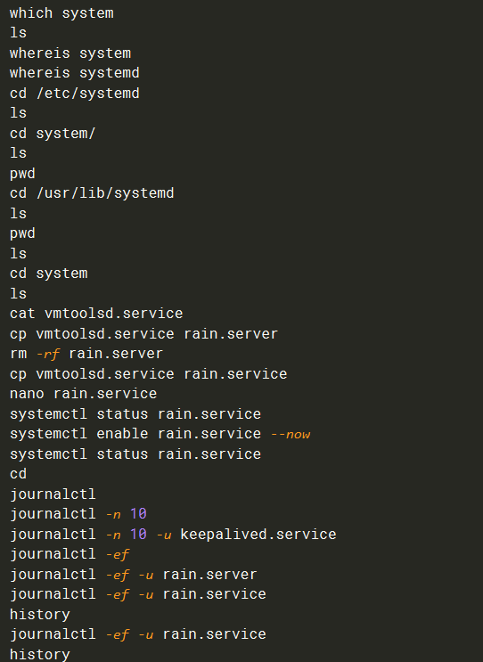
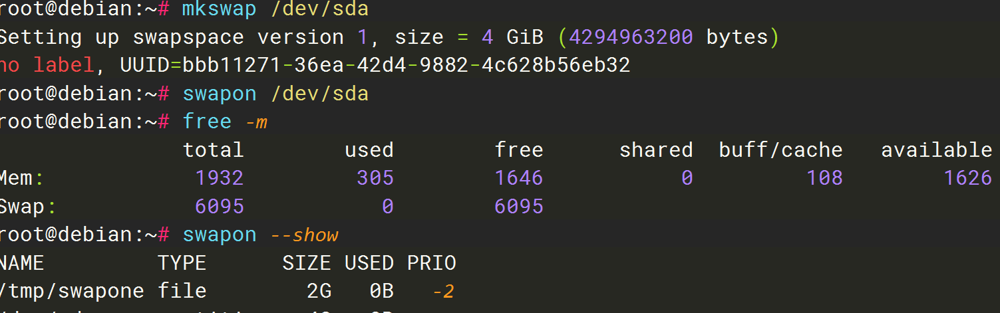
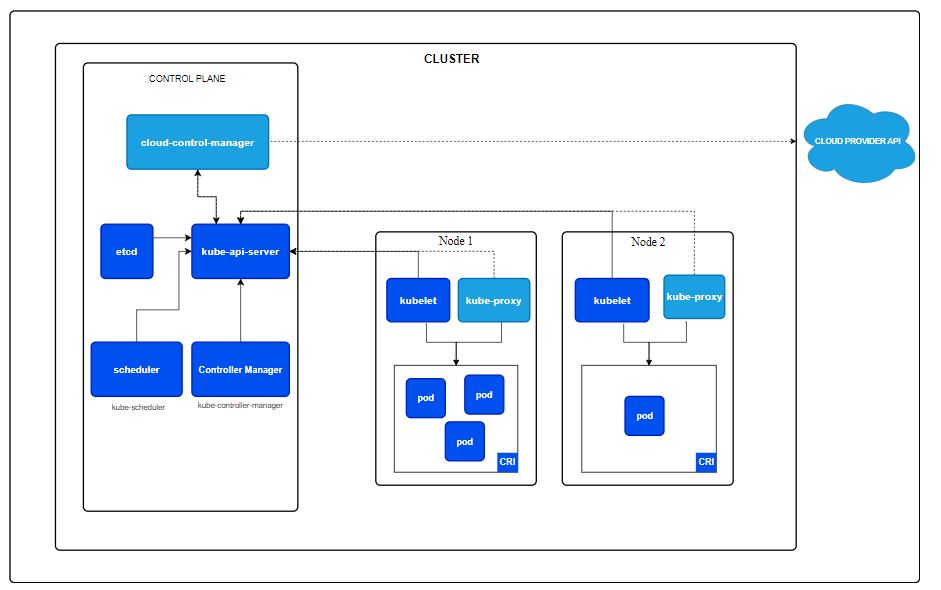
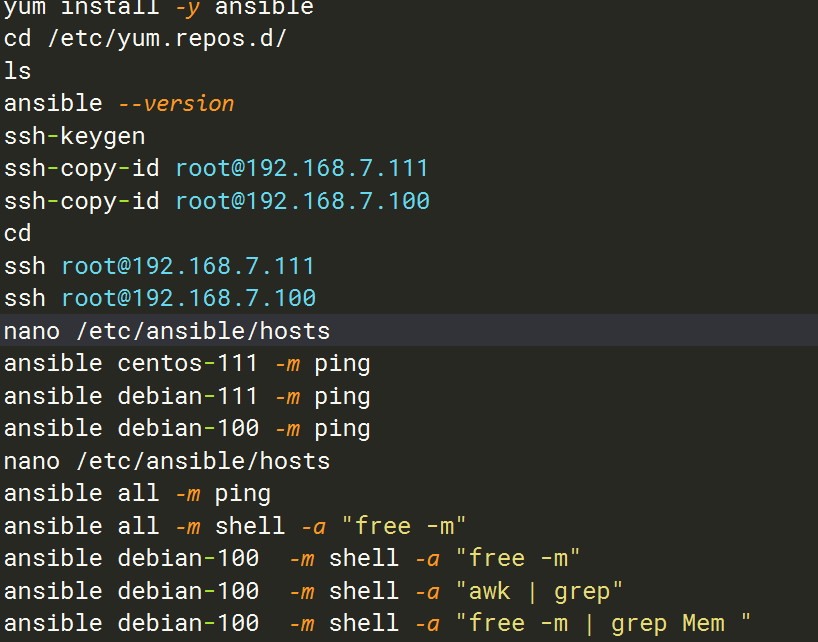
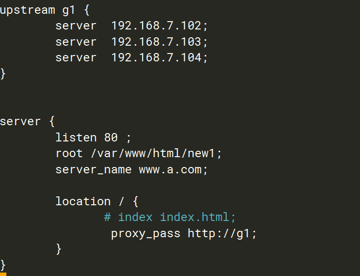
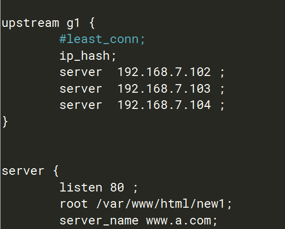
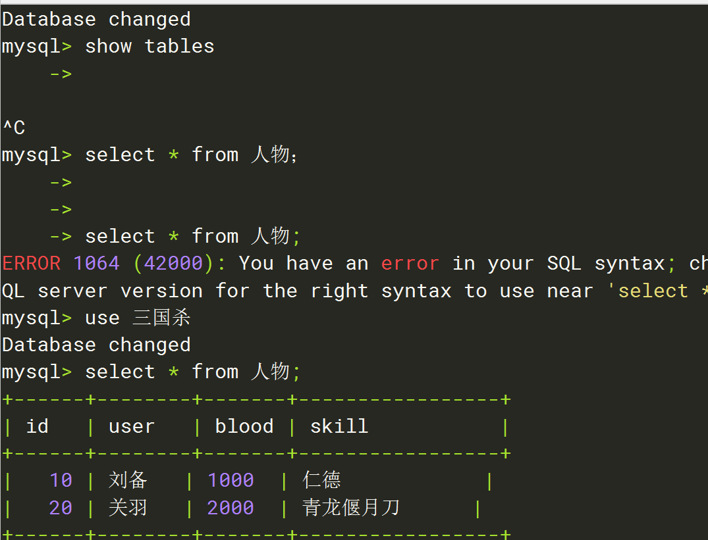
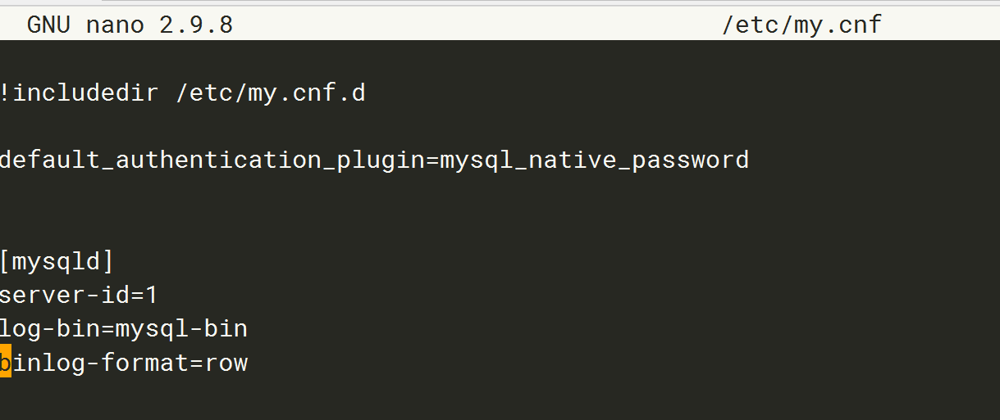

# Linux基础命令

1.uname查看操作系统信息

命令：uname [参数]

` - a 获取全部的系统信息`

2.hostnamectl主机名命令

查看主机名：#hostname/hostnamectl

临时更改主机名：#hostname 临时主机名

永久更改主机名：编辑/etc/sysconfig/network文件，在文件中定义永久主机名

Centos7中主机名分3类，静态的（static）、瞬态的（transient）、和灵活的（pretty）。


设置主机名

用法：输入hostnamectl set-hostname 主机名
示例代码：
#hostnamectl set-hostname heimaserver01.itcast.cn
含义：设置主机名称为heimaserver01.itcast.cn
注意：此设置影响静态和瞬态的主机名


清除旧的密钥

`  ssh-keygen -R ip地址`


# **debian12配置**

## 一、启用用户远程ssh登录

1.进入配置

`nano /etc/ssh/sshd_config`


与远程登陆相关

> #PasswordAuthentication yes 这个选项允许远程登陆用密码来认证, 但加了#号, 不会起作用
> 将前面的#去掉, 变为 PasswordAuthentication yes 可以允许远程用密码登录认证
>
> #PermitRootLogin prohibit-password 设为 PermitRootLogin yes 允许root远程登陆


## 二、配置国内镜像源

* 备份

  `cp /etc/apt/sources.list /etc/apt/sources.list.bak`

* 换源-

  `nano /etc/apt/sources.list`

  `https://www.cnblogs.com/smlile-you-me/p/17727308.html`

  * 华为镜像站

    ~~~bash
    deb https://mirrors.huaweicloud.com/debian/ bookworm main non-free non-free-firmware contrib
    deb-src https://mirrors.huaweicloud.com/debian/ bookworm main non-free non-free-firmware contrib
    deb https://mirrors.huaweicloud.com/debian-security/ bookworm-security main
    deb-src https://mirrors.huaweicloud.com/debian-security/ bookworm-security main
    deb https://mirrors.huaweicloud.com/debian/ bookworm-updates main non-free non-free-firmware con>
    deb-src https://mirrors.huaweicloud.com/debian/ bookworm-updates main non-free non-free-firmware>
    deb https://mirrors.huaweicloud.com/debian/ bookworm-backports main non-free non-free-firmware c>
    deb-src https://mirrors.huaweicloud.com/debian/ bookworm-backports main non-free non-free-firmwa>

    ~~~

  * 中科大镜像站

    ```````bash
    deb https://mirrors.ustc.edu.cn/debian/ bookworm main non-free non-free-firmware contrib
    deb-src https://mirrors.ustc.edu.cn/debian/ bookworm main non-free non-free-firmware contrib
    deb https://mirrors.ustc.edu.cn/debian-security/ bookworm-security main
    deb-src https://mirrors.ustc.edu.cn/debian-security/ bookworm-security main
    deb https://mirrors.ustc.edu.cn/debian/ bookworm-updates main non-free non-free-firmware contrib
    deb-src https://mirrors.ustc.edu.cn/debian/ bookworm-updates main non-free non-free-firmware contrib
    deb https://mirrors.ustc.edu.cn/debian/ bookworm-backports main non-free non-free-firmware contrib
    deb-src https://mirrors.ustc.edu.cn/debian/ bookworm-backports main non-free non-free-firmware contrib
    ```````


  * 阿里云源

    ```
    deb https://mirrors.aliyun.com/debian/ bookworm main non-free non-free-firmware contrib
    deb-src https://mirrors.aliyun.com/debian/ bookworm main non-free non-free-firmware contrib
    deb https://mirrors.aliyun.com/debian-security/ bookworm-security main
    deb-src https://mirrors.aliyun.com/debian-security/ bookworm-security main
    deb https://mirrors.aliyun.com/debian/ bookworm-updates main non-free non-free-firmware contrib
    deb-src https://mirrors.aliyun.com/debian/ bookworm-updates main non-free non-free-firmware contrib
    deb https://mirrors.aliyun.com/debian/ bookworm-backports main non-free non-free-firmware contrib
    deb-src https://mirrors.aliyun.com/debian/ bookworm-backports main non-free non-free-firmware contrib
    ```

    ​

* 更新

  `apt update`

* 测试网络

  `ping www.bing.com`

* 下载

  ` apt install bastet`


## 三、配置静态IP

### 1. 编辑网络接口配置文件

Debian 12 使用 `NetworkManager` 作为默认的网络管理工具，但你仍然可以通过编辑 `/etc/network/interfaces` 文件来配置静态 IP。

- 打开终端，并以管理员身份编辑网络配置文件：

```
bash
复制代码
sudo nano /etc/network/interfaces
```

- 添加或修改以下内容以配置静态 IP（假设你的网络接口是 `eth0`，你可以通过 `ip a` 或 `ifconfig` 命令来查看你的实际网络接口名称）：

```
bash
复制代码
auto eth0
iface eth0 inet static
    address 192.168.1.100  # 你的静态IP地址
    netmask 255.255.255.0  # 子网掩码
    gateway 192.168.1.1    # 网关
    dns-nameservers 8.8.8.8 8.8.4.4  # DNS服务器，可以使用Google的DNS
```

### 2. 重启网络服务

保存并退出编辑器后，重启网络服务以应用新的配置：

```
bash
复制代码
sudo systemctl restart networking
```

或者：

```
bash
复制代码
sudo /etc/init.d/networking restart
```

### 3. 验证配置

使用以下命令验证网络是否正常配置：

```
bash
复制代码
ip a
```

或

```
bash
复制代码
ifconfig
```

### 4. 使用 NetworkManager 配置（可选）

如果你使用的是 `NetworkManager`，也可以通过 `nmtui` 或 `nmcli` 命令配置静态 IP。

- 使用 `nmtui`：

```
bash
复制代码
sudo nmtui
```

选择 `Edit a connection`，然后选择你的网络接口并设置静态 IP。

- 使用 `nmcli`：

```
bash
复制代码
sudo nmcli con show
sudo nmcli con modify <连接名称> ipv4.addresses 192.168.1.100/24
sudo nmcli con modify <连接名称> ipv4.gateway 192.168.1.1
sudo nmcli con modify <连接名称> ipv4.dns "8.8.8.8 8.8.4.4"
sudo nmcli con modify <连接名称> ipv4.method manual
sudo nmcli con up <连接名称>
```


##  四、添加、修改或删除 DNS 服务器的地址

`nano /etc/resolv.conf`

​	

#### hostnamectl 查询和更改系统的主机名以及相关的配置信息

#### lsblk 用来列出所有可用的存储设备及其分区的命令

>- **NAME**: 设备或分区的名称，如 `/dev/sda` 或 `/dev/sda1`。
>- **MAJ:MIN**: 主设备号和次设备号，用于唯一标识设备。
>- **RM**: 表示设备是否是可移除的（removable）。`1` 表示可移除，`0` 表示不可移除。
>- **SIZE**: 设备或分区的大小。
>- **RO**: 表示设备或分区是只读的（read-only）还是可写的（read-write）。`ro` 表示只读，否则为空。
>- **TYPE**: 设备类型，如 `disk`（磁盘）、`part`（分区）等。
>- **MOUNTPOINT**: 如果分区被挂载，这里会显示挂载点。未挂载的分区这里为空。


## 五、网卡配置

### nmcli

` apt install apt-file -y`

`apt-file update`

`apt-file search nmcli`

`apt install network-manager -y`

`nano NetworkManager.conf `

>[main]
>plugins=ifupdown,keyfile
>
>[ifupdown]
>managed=True

`systemctl restart NetworkManager`


## 六、防火墙


在Debian 12上使用UFW（Uncomplicated Firewall）配置防火墙非常简单。UFW 是一个用于简化`iptables`的工具，适合大多数用户管理防火墙规则。

### 1. 安装 UFW

Debian 12 通常会预装 UFW，如果没有安装，可以使用以下命令安装：

```
bash
复制代码
sudo apt update
sudo apt install ufw
```

### 2. 启用 UFW

在配置规则之前，建议首先查看 UFW 的状态，确保它是禁用的：

```
bash
复制代码
sudo ufw status
```

如果 UFW 没有启用，可以通过以下命令启用：

```
bash
复制代码
sudo ufw enable
```

### 3. 配置 UFW 规则

#### 3.1 允许 SSH（端口 22）

为了避免在配置防火墙时将自己锁定在外部服务器之外，建议首先允许 SSH 连接：

```
bash
复制代码
sudo ufw allow ssh
```

#### 3.2 允许 HTTP（端口 80）和 HTTPS（端口 443）

如果你的服务器上运行了 Web 服务，可以通过以下命令允许 HTTP 和 HTTPS 连接：

```
bash
复制代码
sudo ufw allow http
sudo ufw allow https
```

或者，可以一次性允许这两个服务：

```
bash
复制代码
sudo ufw allow 'Nginx Full'
```

或者：

```
bash
复制代码
sudo ufw allow 'Apache Full'
```

#### 3.3 允许特定端口

如果你有其他特定的端口需要开放，例如：

- 允许 MySQL（端口 3306）：

  ```
  bash
  复制代码
  sudo ufw allow 3306
  ```

- 允许特定IP访问某个端口，例如允许192.168.1.100访问端口3306：

  ```
  bash
  复制代码
  sudo ufw allow from 192.168.1.100 to any port 3306
  ```

#### 3.4 拒绝所有其他入站流量

UFW 的默认策略是允许所有传出流量并拒绝所有传入流量。如果你希望在允许必要服务后拒绝其他所有入站流量，可以确保以下规则：

```
bash
复制代码
sudo ufw default deny incoming
sudo ufw default allow outgoing
```

### 4. 启用或禁用 UFW

UFW 规则配置好后，可以通过以下命令启用 UFW：

```
bash
复制代码
sudo ufw enable
```

如果需要临时禁用 UFW，可以使用：

```
bash
复制代码
sudo ufw disable
```

### 5. 查看 UFW 状态和规则

要查看当前的防火墙状态和规则列表，可以运行：

```
bash
复制代码
sudo ufw status verbose
```

### 6. 删除或修改规则

- 删除规则：

  ```
  bash
  复制代码
  sudo ufw delete allow 3306
  ```

- 修改规则则需要先删除旧规则，然后添加新规则。

### 7. 重新加载规则

如果你对配置进行了修改，UFW会自动应用新的规则。你也可以手动重新加载规则：

```
bash
复制代码
sudo ufw reload
```

### 8. 日志记录

如果需要启用日志记录来监控防火墙活动，可以使用以下命令：

```
bash
复制代码
sudo ufw logging on
```

可以通过 `/var/log/ufw.log` 查看日志。

### 结论

通过 UFW，您可以轻松地在 Debian 12 上配置并管理防火墙，确保服务器的安全性。

# **centOS8配置**


## 一、启用用户远程ssh登录

1.进入配置

`nano /etc/ssh/sshd_config`


与远程登陆相关

> #PasswordAuthentication yes 这个选项允许远程登陆用密码来认证, 但加了#号, 不会起作用
> 将前面的#去掉, 变为 PasswordAuthentication yes 可以允许远程用密码登录认证
>
> #PermitRootLogin prohibit-password 设为 PermitRootLogin yes 允许root远程登陆


 使用客户端软件连接linux

 1、什么是SSH

SSH是一种网络协议，用于计算机之间的加密登录。

2、常用SSH终端工具

```bash
SecureCRT
官网：www.vandyke.com SecureCRT是一款支持SSH(SSH1和SSH2)的终端仿真程序，简单地说是Windows下登录UNIX或Linux服务器主机的软件。

XShell
官网：www.netsarang.com

Xshell是一个强大的安全终端模拟软件，它支持SSH1, SSH2, 以及Microsoft Windows 平台的TELNET 协议。Xshell 通过互联网到远程主机的安全连接以及它创新性的设计和特色帮助用户在复杂的网络环境中享受他们的工作。

Putty
官网：www.putty.org

PuTTY为一开放源代码软件，主要由Simon Tatham维护，使用MIT licence授权。

MobaXterm
官网：https://mobaxterm.mobatek.net/

3、使用MobaXterm连接linux
步骤1：打开软件，点击session

步骤2：在弹出窗口中选择ssh，在 remote host对话框输入要连接的服务器IP地址

步骤3：输入用户名和密码，注意输入密码的时候，屏幕是没有反应的。

步骤4：输入用户密码后回车，看到如下界面，表示已经成功连接
```


## 二、配置本地YUM源

进入 /etc/yum.repos.d/ 存放 YUM 仓库配置文件的目录

1.挂载CentOS安装光盘

```mount /dev/cdrom  /mnt/cd```

2.禁用网络yum源

```bash
cd /etc/yum.repos.d/
mv CentOS-Base.repo CentOS-Base.repo.bak
```

3.配置光盘yum源

```bash
vi /etc/yum.repos.d/CentOS-Media.repo
```

``````bash
[BaseOS]
name=CentOS Linux BaseOS
baseurl=/mnt/cd/BaseOS
gpgcheck=0
enabled=1

[AppStream]
name=CentOS Linux AppStream
baseurl=/mnt/cd/AppStream
gpgcheck=0
enabled=1
``````

4. yum makecache 用于构建或更新 YUM 仓库的缓存   

`dnf list installed`  DNF  包管理器 用于列出系统上所有已安装的软件包

`dnf provides filename `用于查找提供特定文件或功能的软件包

`dnf module list [模块名]`用于列出可用的软件模块及其流（stream）和配置文件（profiles）

`dnf module install <模块名> `  用于安装特定版本的软件模块及其依赖项


`systemctl disable firewalld.service `

`nano /etc/selinux/config`


`reboot`


1.下载安装镜像源

- 使用wget命令下载镜像源，本次使用的源为阿里云镜像：

```shell
#下载并替换源
wget https://mirrors.aliyun.com/repo/Centos-vault-8.5.2111.repo -O /etc/yum.repos.d/Centos-vault-8.5.2111.repo
wget https://mirrors.aliyun.com/repo/epel-archive-8.repo -O /etc/yum.repos.d/epel-archive-8.repo
```

- 使用命令设置源： 


```shell
sed -i 's/mirrors.cloud.aliyuncs.com/url_tmp/g'  /etc/yum.repos.d/Centos-vault-8.5.2111.repo &&  sed -i 's/mirrors.aliyun.com/mirrors.cloud.aliyuncs.com/g' /etc/yum.repos.d/Centos-vault-8.5.2111.repo && sed -i 's/url_tmp/mirrors.aliyun.com/g' /etc/yum.repos.d/Centos-vault-8.5.2111.repo
sed -i 's/mirrors.aliyun.com/mirrors.cloud.aliyuncs.com/g' /etc/yum.repos.d/epel-archive-8.repo

```

- 其中http://mirrors.cloud.aliyuncs.com需要替换为http://mirrors.aliyun.com，但是官方提供的命令没替换完，并且官方命令针对的是具有公网访问能力的ECS实例，若官方替换命令还是会报错的话，使用以下命令：

```shell
sed -i 's/mirrors.cloud.aliyuncs.com/mirrors.aliyun.com/g'  /etc/yum.repos.d/Centos-vault-8.5.2111.repo 
sed -i 's/mirrors.cloud.aliyuncs.com/mirrors.aliyun.com/g'  /etc/yum.repos.d/epel-archive-8.repo
```

 建立yum缓存并测试

- 建立yum缓存
  `yum clean all && yum makecache #清除原yum缓存建立新缓存`
- 测试yum命令
  `yum update -y #使用yum更新测试源可用性` 或者随便装个包试一试。


## 三、配置网卡方式

### 方式一：编辑文件

```nano /etc/sysconfig/network-scripts/ifcfg-ens160```

添加

```bash
IPADDR=192.168.7.66
NETMASK=255.255.255.0
GATEWAY=192.168.7.2
DNS1=8.8.8.8
```


查看网卡状态

```shell
用法一：systemctl  status network
示例代码：
#systemctl  status network
含义：查看网络状态，active表示启用的，活动的。
```


 systemctl启动/重启/停止网卡

```shell
用法一：systemctl start/stop/restart network
示例代码：
#systemctl stop network
含义：停止网卡服务

#systemctl start network
含义：开启网卡服务

#systemctl restart network
含义：重启网卡服务
```


重启网卡

` systemctl restart network`

### 方式二：nmcli

1.创建

`nmcli c 查看连接`

`nmcli d 查看网卡设备`

``` bash
nmcli connection add type ethernet ifname ens160 ipv4.method manual con-name rainconnection ipv4.addresses "192.168.7.26/24" ipv4.gateway "192.168.7.2" ipv4.dns 8.8.8.8 autoconnect yes
```

`nmcli c modify ens160  autoconnect no`

2.启用

`nmcli connection up rainconnection  `


3.更改

`nmcli c modify rainconnection2 ipv4.addresses "192.168.7.31/24"`

虚拟网卡

`nmcli connection add con-name mybond0 type bond mode active-backup ipv4.addresses "192.168.7.30/24" ipv4.gateway "192.168.7.2" ipv4.dns 8.8.8.8`


### 配置静态ip

1. **编辑配置文件**：
   使用文本编辑器（如vim或nano）编辑对应的网络接口配置文件。对于大多数CentOS 8系统，网络接口配置文件位于`/etc/sysconfig/network-scripts/`目录下，文件名通常为`ifcfg-`加上网卡名称（如`ifcfg-ens33`）。

   ```
   sudo vim /etc/sysconfig/network-scripts/ifcfg-ens33
   ```

2. **修改配置内容**：
   在配置文件中，你需要将`BOOTPROTO`设置为`static`，将`ONBOOT`设置为`yes`，并添加或修改`IPADDR`（IP地址）、`NETMASK`（子网掩码）、`GATEWAY`（默认网关）和`DNS1`（首选DNS服务器）等参数。例如：

   ```
   bash复制代码

   TYPE=Ethernet  
   BOOTPROTO=static  
   DEFROUTE=yes  
   PEERDNS=yes  
   PEERROUTES=yes  
   IPV4_FAILURE_FATAL=no  
   IPV6INIT=yes  
   IPV6_AUTOCONF=yes  
   IPV6_DEFROUTE=yes  
   IPV6_FAILURE_FATAL=no  
   IPV6_ADDR_GEN_MODE=stable-privacy  
   NAME=ens33  
   UUID=你的UUID值（保持原样或删除此行）  
   DEVICE=ens33  
   ONBOOT=yes  
   IPADDR=192.168.1.100  
   PREFIX=24  
   GATEWAY=192.168.1.1  
   DNS1=8.8.8.8
   ```

   注意：根据你的网络环境，`UUID`值可能不需要修改，但如果你不确定，可以删除此行或保持原样。`PREFIX`参数是子网掩码的一种表示方式，`24`代表子网掩码为`255.255.255.0`。

3. **重启网络服务**：
   ​

   ```
   bash复制代码

   sudo systemctl restart NetworkManager
   ```


## 四、链路聚合

- nmcli device


- 主链路 虚拟网卡

  ```nmcli connection add con-name new-bond ifname bond0 type bond mode active-backup ipv4.addresses   "192.168.7.30/24" ipv4.gateway "192.168.7.2" ipv4.dns 8.8.8.8  ipv4.method manual```


- 网卡分链路  物理网卡

  `nmcli connection  add con-name mybond0-224 ifname ens224 type bond-slave master bond0  `

   `nmcli connection add con-name mybond0-160  ifname ens160 type bond-slave master bond0 `


`yum install httpd -y`   安装

`systemctl status httpd`

`systemctl start  httpd`   启动http

`ss -tunlp`   查看端口

`curl 127.0.0.1`   本地访问


## 五、防火墙

`systemctl start firewalld.service `

`cd /usr/lib/firewalld/services`

`firewall-cmd  --list-all-zones `  查看所有策略

`firewall-cmd  --list-all`  查看当前策略

`firewall-cmd  --set-default-zone=public`  设置默认策略

`firewall-cmd --permanent --zone=public --add-service=http `  添加服务

`firewall-cmd reload ` 重载


` nano /etc/selinux/config  #关闭安全策略`    

 ` systemctl stop firewalld #关闭防火墙  `

在 CentOS 8 中，防火墙主要通过 `firewalld` 管理，而 `iptables` 在大多数情况下已经被弃用。`firewalld` 提供了一种更高级别的接口来管理防火墙规则，并且支持区域和服务的配置。

以下是如何在 CentOS 8 上配置防火墙的基本步骤：

### 1. 安装并启用 `firewalld`

`firewalld` 通常在 CentOS 8 中默认安装，如果没有，可以通过以下命令安装：

```bash
sudo dnf install firewalld
```

然后启动并启用 `firewalld` 服务：

```bash
sudo systemctl start firewalld
sudo systemctl enable firewalld
```

### 2. 检查防火墙状态

可以使用以下命令查看 `firewalld` 的状态：

```
systemctl status firewalld
```

```bash
sudo firewall-cmd --state
```


重载操作

```bash
# systemctl reload firewalld
```


### 3. 配置基本的防火墙规则

#### 查看当前区域

`firewalld` 使用区域（zone）来管理网络接口。首先，可以查看当前活跃的区域：

```bash
sudo firewall-cmd --get-active-zones
```

#### 将接口分配到指定区域

你可以将网络接口分配到特定的区域，例如将 `eth0` 接口分配到 `public` 区域：

```bash
sudo firewall-cmd --zone=public --change-interface=eth0 --permanent
```

#### 允许特定服务或端口

- **允许服务**: `firewalld` 使用预定义的服务，可以通过服务名来允许特定流量。例如，允许 HTTP 和 HTTPS 流量：

  ```bash
  sudo firewall-cmd --zone=public --add-service=http --permanent
  sudo firewall-cmd --zone=public --add-service=https --permanent
  ```

- **允许端口**: 如果服务没有预定义的规则，也可以直接允许特定端口。例如，允许 8080 端口的 TCP 流量：

  ```bash
  sudo firewall-cmd --zone=public --add-port=8080/tcp --permanent
  ```

#### 删除服务或端口
- **删除服务**: 如果你想删除一个已允许的服务，例如 SSH 服务：

  ```bash
  sudo firewall-cmd --zone=public --remove-service=ssh --permanent
  ```

- **删除端口**: 如果你想删除一个已允许的端口，例如 8080 端口：

  ```bash
  sudo firewall-cmd --zone=public --remove-port=8080/tcp --permanent
  ```

### 4. 重新加载防火墙规则
在修改防火墙规则后，需要重新加载以使更改生效：

```bash
sudo firewall-cmd --reload
```

### 5. 查看当前的规则
要查看当前配置的防火墙规则，可以使用以下命令：

```bash
sudo firewall-cmd --list-all
```

### 6. 设置默认区域
默认区域是所有未明确分配到其他区域的接口使用的区域。可以通过以下命令设置默认区域：

```bash
sudo firewall-cmd --set-default-zone=public
```

### 7. 开启或关闭防火墙
如果你需要临时禁用或启用防火墙，可以使用以下命令：

- **关闭防火墙**:
  ```bash
  sudo systemctl stop firewalld
  sudo systemctl disable firewalld
  ```

- **开启防火墙**:
  ```bash
  sudo systemctl start firewalld
  sudo systemctl enable firewalld
  ```

### 8. 使用 `rich rules` 创建更复杂的规则
`firewalld` 支持使用 `rich rules` 创建更加复杂和细粒度的规则。例如，你可以允许特定 IP 地址访问某个端口：

```bash
sudo firewall-cmd --zone=public --add-rich-rule='rule family="ipv4" source address="192.168.1.100" port protocol="tcp" port="22" accept' --permanent
```

配置完成后，你可以使用 `firewalld` 来根据需要进行进一步的配置和调整，确保你的系统安全并且开放必要的网络服务。


## 六、包管理 (`dnf` 是一个包管理器)

- 列出系统上已安装的所有软件包 使用`dnf`命令配合`list`和`installed`选项

​      `  #列出已安装软件包   dnf list installed`

- 如果你只对特定类型的软件包感兴趣，或者想要通过搜索特定关键字来过滤结果，你可以使用`grep`命令来辅助完成。例如，要列出所有已安装的与`python`相关的软件包，你可以这样做：

​    `dnf list installed | grep python`

- `dnf provides`命令用于查找提供特定文件或功能的软件包。

例：

`dnf provides ping `   系统会搜索并列出所有包含`ping`命令的软件包

- 通过软件模块（modules）来管理不同版本的软件包

1. **查看可用的Python模块**：
   首先，你可以使用`dnf module list python`命令来查看所有可用的Python模块及其版本。这个命令会列出所有与Python相关的模块，包括它们的版本和状态（如默认、启用、禁用等）。

2. **启用Python 3.9模块**（如果可用）：
   如果`dnf module list python`显示有Python 3.9的模块可用，你可以使用`dnf module enable python39`命令来启用它。注意，这里的`python39`可能需要根据实际列出的模块名称进行调整。

3. **安装Python 3.9**：
   启用模块后，你可以使用`dnf install python3`（注意不是`python39`，因为通常安装命令是针对软件包名称的，而不是模块名称）来安装Python 3。但是，由于你已经启用了Python 3.9模块，`dnf`将会安装该模块提供的Python版本，即Python 3.9。

   如果你想要确保安装的是特定版本的Python（例如，当系统中有多个Python版本时），你可以使用`dnf install python3.9`（但这通常不是必要的，因为`python3`命令通常会指向启用的模块版本）。然而，请注意，并不是所有的发行版都会为Python的每个版本都提供`pythonX.Y`这样的软件包名称。

4. **验证安装**：
   安装完成后，你可以通过运行`python3 --version`来验证安装的Python版本。


# DNF

> 是基于 RPM 的 Linux 发行版的软件包管理器它用于在 Fedora / RHEL / CentOS 操作系统中安装，更新和删除软件包。 它是 Fedora 22，CentOS8 和 RHEL8 的默认软件包管理器。 DNF 是 YUM 的下一代版本，并打算在基于 RPM 的系统中替代 YUM。 DNF 功能强大且具有健壮的特征。DNF 使维护软件包组变得容易，并且能够自动解决依赖性问题。
>
> 注：目前 DNF 命令和 YUM 命令相互兼容，软件包仓库依旧使用 YUM 仓库。


## 安装dnf

### 1.为了安装 dnf ，必须先安装并启用 epel-release 依赖

​	` yum install epel-release`

### 2.使用 epel-release 依赖中的 YUM 命令来安装 dnf 包

​	` yum install dnf `

## 常用命令介绍

```bash
查看dnf版本
dnf --version

查看系统可用的dnf软件库
dnf repolist 

查看系统中可用和不可用的软件库
dnf repolist all

列出所有RPM包
dnf list

列出已经安装的RPM包
dnf list installed

列出可供安装的RPM包
dnf list available

搜索某包 (以搜索nginx为例)
dnf search nginx

列出模块：(列出所有可用的模块及其版本) 
例如，dnf module list nginx 会列出所有可用的 Nginx 模块版本和配置。
dnf module list

安装 

已安装软件包

[root@Linux1 ~]# dnf list installed

查找软件包

[root@Linux1 ~]# dnf search httpd

安装软件包

[root@Linux1 ~]# dnf install httpd –y

卸载软件包

[root@Linux1 ~]# dnf remove httpd –y

下载软件包

[root@Linux1 ~]# dnf download httpd

查看软件包信息

[root@Linux1 ~]# dnf info httpd

检查系统中可更新软件包

[root@Linux1 ~]# dnf check-update

更新所有软件包

[root@Linux1 ~]# dnf update

或者

[root@Linux1 ~]# dnf upgrade

更新指定软件包

[root@Linux1 ~]# dnf update httpd

列出软件包组

[root@Linux1 ~]# dnf grouplist

安装软件包组

[root@Linux1 ~]# dnf groupinstall '开发工具'

更新软件包组

[root@Linux1 ~]# dnf groupupdate '开发工具'

清空所有缓存

在使用 DNF 的过程中，会因为各种原因在系统中残留各种过时的文件和未完成的编译工程。我们可以使用该命令来删除这些没用的垃圾文件。并且软件仓库中的软件包依赖也会被清空，再次安装软件时则重新下载软件包依赖信息。

[root@Linux1 ~]# dnf clean all

[root@Linux1 ~]# yum clean all

重新创建新的软件包依赖关系

[root@Linux1 ~]# dnf makecache

或直接

[root@Linux1 ~]# yum makecache

我一般使用 :

[root@Linux1 ~]# yum clean all

[root@Linux1 ~]# yum list #

当清空后， 列出软件列表时，会自动创建新的软件包依赖关系
```


# systemctl




# 常见问题解决

1.ping 不通网络

` nano /etc/sysconfig/network-scripts/ifcfg-ens160`

```bash
IPADDR=192.168.7.66
NETMASK=255.255.255.0
GATEWAY=192.168.7.2
DNS1=8.8.8.8
```

` systemctl restart network`


2.curl 连接失败

```bash
yum install httpd
systemctl enable httpd
systemctl start httpd
```


## 密钥

```shell
管理节点与被管理节点建立SSH信任关系
创建密钥对
ssh-keygen -t rsa

将本地公钥传输到被管理节点
ssh-copy-id root@192.168.7.88

查看密钥
ls .ssh

连接
ssh 'root@192.168.7.88'
```


# **磁盘管理**

`fdisk` 和 `gdisk` 是两个用于在 Linux 系统上管理磁盘分区的命令行工具。它们主要用于创建、删除和修改磁盘分区，但它们适用于不同类型的分区表。

### 1. `fdisk`

#### 1.1 概述

`fdisk` 是一个经典的分区管理工具，主要用于管理使用 **MBR（Master Boot Record）** 分区表的磁盘。MBR 是一种较旧的分区表格式，支持最多四个主分区或三个主分区加一个扩展分区，并且最大支持 2TB 的磁盘。

#### 1.2 常见操作

1. **列出分区**:
   ```bash
   sudo fdisk -l
   ```

2. **选择磁盘**:
   ```bash
   sudo fdisk /dev/sdX
   ```
   `X` 是磁盘设备的标识符，比如 `/dev/sda`。

3. **查看现有分区**:
   在 `fdisk` 交互模式下，按 `p` 键可以查看现有的分区表。

4. **创建新分区**:
   按 `n` 键，然后选择要创建的分区类型（主分区或逻辑分区），接着指定分区号和大小。

5. **删除分区**:
   按 `d` 键，然后选择要删除的分区号。

6. **写入分区表**:
   按 `w` 键将更改写入磁盘。

7. **退出**:
   按 `q` 键退出而不保存更改。

### 2. `gdisk`

#### 2.1 概述

`gdisk` 是一个类似于 `fdisk` 的工具，但它是专门为管理 **GPT（GUID Partition Table）** 分区表设计的。GPT 是一种较新的分区表格式，相较于 MBR，它支持更多的分区（通常支持 128 个分区）和更大的磁盘（超过 2TB），并且具有更高的可靠性和灵活性。

#### 2.2 常见操作

1. **列出 GPT 分区**:
   ```bash
   sudo gdisk -l /dev/sdX
   ```

2. **选择磁盘**:
   ```bash
   sudo gdisk /dev/sdX
   ```

3. **查看现有分区**:
   在 `gdisk` 交互模式下，按 `p` 键可以查看现有的分区表。

4. **创建新分区**:
   按 `n` 键，然后选择分区号、起始扇区和结束扇区。

5. **删除分区**:
   按 `d` 键，然后选择要删除的分区号。

6. **转换 MBR 到 GPT**:
   如果你有一个使用 MBR 的磁盘并希望转换为 GPT，可以使用 `gdisk` 的转换功能。注意，这个操作可能会导致数据丢失，因此建议先备份数据。

7. **写入分区表**:
   按 `w` 键将更改写入磁盘。

8. **退出**:
   按 `q` 键退出而不保存更改。

### 3. 主要区别

- **分区表类型**:
  - `fdisk` 主要用于 MBR 分区表。
  - `gdisk` 专为 GPT 分区表设计。

- **支持的磁盘大小**:
  - MBR（`fdisk`）支持的磁盘最大为 2TB。
  - GPT（`gdisk`）可以支持超过 2TB 的磁盘。

- **分区数量**:
  - MBR 支持最多 4 个主分区（或者 3 个主分区 + 1 个扩展分区）。
  - GPT 支持更多分区，通常可以达到 128 个。

### 4. 使用建议

- 对于较新的系统和大容量磁盘（超过 2TB），建议使用 GPT（即 `gdisk`）。
- 对于旧系统或者需要兼容性（如某些BIOS无法引导GPT磁盘），则可能需要使用 MBR（即 `fdisk`）。


### 5.格式化

1. **列出所有分区**：使用 `lsblk` 或 `fdisk -l` 命令来列出系统中的所有分区。

   ```
   bash
   复制代码
   lsblk
   ```

   或

   ```
   bash
   复制代码
   sudo fdisk -l
   ```

2. **选择要格式化的分区**：假设要格式化的分区是 `/dev/sdX1`，请将 `sdX1` 替换为你的实际分区名称。

3. **卸载分区（如果已经挂载）**：如果目标分区已经挂载，需要先卸载它。使用 `umount` 命令。

   ```
   bash
   复制代码
   sudo umount /dev/sdX1
   ```

4. **格式化分区**：可以使用 `mkfs` 命令选择你想要的文件系统类型进行格式化。常用的文件系统类型包括 `ext4`, `xfs`, `vfat` (FAT32) 等。

   - 格式化为 

     ```
     ext4
     ```

      文件系统：

     ```
     bash
     复制代码
     sudo mkfs.ext4 /dev/sdX1
     ```

   - 格式化为 

     ```
     xfs
     ```

      文件系统：

     ```
     bash
     复制代码
     sudo mkfs.xfs /dev/sdX1
     ```

   - 格式化为 

     ```
     vfat
     ```

      (FAT32) 文件系统：

     ```
     bash
     复制代码
     sudo mkfs.vfat /dev/sdX1
     ```

5. **验证格式化是否成功**：你可以再次使用 `lsblk` 或 `blkid` 来检查分区并验证格式化是否成功。

   ```
   bash
   复制代码
   lsblk
   ```

   或

   ```
   bash
   复制代码
   sudo blkid /dev/sdX1
   ```

6. **重新挂载分区（可选）**：如果需要使用该分区，可以重新挂载它。

   ```
   bash
   复制代码
   sudo mount /dev/sdX1 /mnt
   ```

完成这些步骤后，你的分区将被格式化为指定的文件系统。


6.

UUID=630b91a6-5d0b-4caa-b592-6a63d32bc0db /                       xfs     defaults        0 0


## swap交换分区


新加硬盘作为虚拟分区使用    格式化启用 写入永久挂载




​	


# dd

在Linux系统中，交换分区（swap partition）是一种特殊的分区，用于在物理内存（RAM）不足时，临时存储内存中的数据。这可以帮助系统在高负载下维持运行，而不至于因为内存不足而崩溃。

创建并启用Linux交换分区的步骤如下：

### 1. 检查现有的交换分区

首先，检查系统中是否已经有交换分区：

```
bash
复制代码
sudo swapon --show
```

如果没有输出，说明当前系统没有启用的交换分区。

### 2. 创建交换分区

#### a. 使用`fallocate`命令创建交换文件

你可以使用`fallocate`命令快速创建一个交换文件，例如创建一个2GB的交换文件：

```
bash
复制代码
sudo fallocate -l 2G /swapfile
```

#### b. 如果系统不支持`fallocate`，使用`dd`命令

如果`fallocate`命令不可用，可以使用`dd`命令创建交换文件：

```
bash
复制代码
sudo dd if=/dev/zero of=/swapfile bs=1M count=2048
```

此命令将创建一个2GB的交换文件。

### 3. 设置交换文件的权限

为确保交换文件的安全性，需要修改文件的权限：

```
bash
复制代码
sudo chmod 600 /swapfile
```

### 4. 将文件设为交换空间

将文件转换为交换空间：

```
bash
复制代码
sudo mkswap /swapfile
```

### 5. 启用交换空间

启用刚刚创建的交换空间：

```
bash
复制代码
sudo swapon /swapfile
```

### 6. 验证交换空间是否启用

再次检查交换空间是否已启用：

```
bash
复制代码
sudo swapon --show
```

### 7. 配置交换文件在系统启动时自动挂载

要使交换文件在系统启动时自动挂载，需要将其添加到`/etc/fstab`文件中：

```
bash
复制代码
echo '/swapfile none swap sw 0 0' | sudo tee -a /etc/fstab
```

这样，交换分区就会在每次系统启动时自动挂载并启用。

### 8. 调整交换使用策略（可选）

你可以通过调整`/proc/sys/vm/swappiness`来控制系统何时开始使用交换空间。默认值通常是60（范围是0到100），值越大，系统越倾向于使用交换空间。你可以通过以下命令查看当前值：

```
bash
复制代码
cat /proc/sys/vm/swappiness
```

如果你想调整这个值，例如将其设置为10：

```
bash
复制代码
sudo sysctl vm.swappiness=10
```

要使这个更改在系统重启后保持有效，可以将它添加到`/etc/sysctl.conf`文件中：

```
bash
复制代码
echo 'vm.swappiness=10' | sudo tee -a /etc/sysctl.conf
```

完成以上步骤后，你的Linux系统就会拥有一个有效的交换分区，能够在物理内存不足时提供辅助支持。


# 文件管理 

### 1. `more`

`more`命令用于逐页查看长文件的内容。它会显示文件的前几行，并在屏幕满时暂停，等待用户按下按键（通常是空格键）以显示下一页。

**使用示例：**

```
bash
复制代码
more filename.txt
```

**常用操作：**

- `空格键`: 显示下一屏内容。
- `Enter键`: 显示下一行内容。
- `q`: 退出查看。

### 2. `less`

`less`命令与`more`类似，但功能更强大。它允许在文件中前后滚动，并提供更多的搜索和导航功能。

**使用示例：**

```
bash
复制代码
less filename.txt
```

**常用操作：**

- `空格键`: 显示下一屏内容。
- `b`: 显示上一屏内容。
- `/pattern`: 向前搜索指定的模式。
- `?pattern`: 向后搜索指定的模式。
- `n`: 重复前一个搜索。
- `q`: 退出查看。

### 3. `tail`

`tail`命令用于查看文件的最后几行，通常用于实时监控日志文件的更新。

**使用示例：**

```
bash
复制代码
tail filename.txt
```

默认情况下，`tail`会显示文件的最后10行。

**常用选项：**

- `-n N`: 显示最后N行内容。例如，显示最后20行：

  ```
  bash
  复制代码
  tail -n 20 filename.txt
  ```

- `-f`: 实时跟踪文件的新增内容，通常用于监控日志文件：

  ```
  bash
  复制代码
  tail -f filename.txt
  ```

### 4. `head`

`head`命令用于查看文件的前几行内容，默认显示前10行。

**使用示例：**

```
bash
复制代码
head filename.txt
```

**常用选项：**

- `-n N`: 显示前N行内容。例如，显示前20行：

  ```
  bash
  复制代码
  head -n 20 filename.txt
  ```

### 5. `grep`

`grep`命令用于在文件中搜索匹配指定模式的行，并将这些行输出到终端。它是一个非常强大的文本搜索工具，支持正则表达式。

**使用示例：**

```
bash
复制代码
grep "pattern" filename.txt
```

**常用选项：**

- `-i`: 忽略大小写进行搜索。
- `-r` 或 `-R`: 递归地在目录中搜索。
- `-v`: 反向搜索，显示不匹配模式的行。
- `-n`: 显示匹配行的行号。
- `-o`: 只输出匹配到的部分。

**示例：**

- 在文件中搜索包含"error"的行，忽略大小写：

  ```
  bash
  复制代码
  grep -i "error" filename.txt
  ```

- 在当前目录及其子目录中递归搜索包含"TODO"的文件：

  ```
  bash
  复制代码
  grep -r "TODO" .
  ```


`find` 命令是 Linux 和 Unix 系统中非常强大的工具，用于在目录树中搜索文件和目录。它可以根据各种条件（如文件名、类型、修改时间、大小等）搜索文件，并且可以对搜索结果执行操作。以下是 `find` 命令的常用选项和示例：

### 基本语法

```
bash
复制代码
find [起始目录] [搜索条件] [执行的操作]
```

### 常用选项和搜索条件

1. **按名称搜索文件 (-name)**

   ```
   bash
   复制代码
   find /path/to/search -name "filename"
   ```

   - 搜索名称为 `filename` 的文件或目录。支持通配符（例如 `*.txt`）。

2. **按类型搜索 (-type)**

   ```
   bash
   复制代码
   find /path/to/search -type f  # 搜索普通文件
   find /path/to/search -type d  # 搜索目录
   ```

   - `f` 表示普通文件，`d` 表示目录。还可以搜索符号链接 (`-type l`)、字符设备 (`-type c`) 等。

3. **按大小搜索 (-size)**

   ```
   bash
   复制代码
   find /path/to/search -size +50M  # 搜索大于50MB的文件
   find /path/to/search -size -100k  # 搜索小于100KB的文件
   ```

   - `+` 表示大于，`-` 表示小于。单位可以是 `c` (字节)，`k` (KB)，`M` (MB)，`G` (GB) 等。

4. **按修改时间搜索 (-mtime)**

   ```
   bash
   复制代码
   find /path/to/search -mtime -7  # 搜索7天内修改过的文件
   find /path/to/search -mtime +30  # 搜索30天前修改过的文件
   ```

   - `-mtime` 按修改时间搜索，以天为单位。`-atime` 搜索按访问时间，`-ctime` 按更改时间（如权限或所有权变化）。

5. **按文件权限搜索 (-perm)**

   ```
   bash
   复制代码
   find /path/to/search -perm 644  # 搜索权限为644的文件
   find /path/to/search -perm /u+x  # 搜索所有者可执行的文件
   ```

   - 可以指定特定的权限模式，或使用符号模式（如 `/u+x`，表示所有者可执行）。

6. **按用户或组搜索 (-user, -group)**

   ```
   bash
   复制代码
   find /path/to/search -user username  # 搜索属于指定用户的文件
   find /path/to/search -group groupname  # 搜索属于指定组的文件
   ```

7. **按深度限制搜索 (-maxdepth, -mindepth)**

   ```
   bash
   复制代码
   find /path/to/search -maxdepth 2 -name "*.log"  # 只搜索到第2层目录
   find /path/to/search -mindepth 3 -name "*.log"  # 只搜索第3层及更深的目录
   ```

### 执行操作

你可以对搜索结果执行各种操作，如删除、复制、移动等。

1. **删除搜索到的文件 (-delete)**

   ```
   bash
   复制代码
   find /path/to/search -name "*.tmp" -delete  # 删除所有.tmp文件
   ```

2. **对搜索到的文件执行命令 (-exec)**

   ```
   bash
   复制代码
   find /path/to/search -name "*.sh" -exec chmod +x {} \;  # 将所有.sh文件设为可执行
   ```

   - `{}` 代表找到的每个文件，`\;` 表示命令结束。`-exec` 允许你对每个匹配的文件执行命令。

3. **打印搜索结果 (-print)**

   ```
   bash
   复制代码
   find /path/to/search -name "*.conf" -print
   ```

   - 默认情况下，`find` 会打印搜索结果，但你可以明确指定。

### 示例用法

1. **查找大于100MB的所有 .log 文件**

   ```
   bash
   复制代码
   find /var/log -name "*.log" -size +100M
   ```

2. **查找30天内修改的 .conf 文件并将其复制到备份目录**

   ```
   bash
   复制代码
   find /etc -name "*.conf" -mtime -30 -exec cp {} /backup/ \;
   ```

3. **查找并删除所有的临时文件**

   ```
   bash
   复制代码
   find /tmp -type f -name "*.tmp" -delete
   ```

4. **查找并列出所有普通用户可执行的文件**

   ```
   bash
   复制代码
   find /usr/local/bin -type f -perm /u+x -print
   ```

5. **查找所有属于特定用户的文件**

   ```
   bash
   复制代码
   find /home -user username
   ```

`find` 是非常强大的命令行工具，通过灵活组合各种选项，可以实现复杂的文件搜索和操作任务。


   


#  逻辑卷管理（LVM）

### LVM的主要组件：

1. **物理卷 (Physical Volume, PV)**：
   - 物理卷是实际的物理存储设备，比如硬盘或分区，你可以将这些设备加入到LVM系统中。
2. **卷组 (Volume Group, VG)**：
   - 卷组是通过组合一个或多个物理卷创建的存储池。可以将其看作一个大的存储空间，用来创建逻辑卷。
3. **逻辑卷 (Logical Volume, LV)**：
   - 逻辑卷相当于卷组中的“分区”。你可以根据需要创建、调整大小或删除这些逻辑卷。使用LV的好处在于它们的灵活性——你可以轻松调整大小，甚至可以跨多个物理磁盘扩展它们。
4. **逻辑区块 (Logical Extents, LE) 和物理区块 (Physical Extents, PE)**：
   - 逻辑卷被划分为逻辑区块（LE），而物理卷被划分为物理区块（PE）。这些区块是存储的基本单元，默认大小为4 MB，不过这个大小可以更改。

### 基本的LVM工作流程：

1. **创建物理卷 (PV)**：

   - 使用

     ```
     pvcreate
     ```

     命令将物理设备（如分区或整个硬盘）转换为物理卷。例如：

     ```
     pvcreate /dev/sda1
     ```

2. **创建卷组 (VG)**：

   - 使用

     ```
     vgcreate
     ```

     命令将一个或多个物理卷合并为卷组。例如：

     ```
     vgcreate my_vg /dev/sda1 /dev/sdb1
     ```

3. **创建逻辑卷 (LV)**：

   - 使用

     ```
     lvcreate
     ```

     命令从卷组中分配空间来创建逻辑卷。例如：

     ```
     lvcreate -L 10G -n my_lv my_vg
     ```

4. **格式化和挂载逻辑卷**：

   - 创建好逻辑卷后，需要格式化并挂载。例如：

     ```
     mkfs.ext4 /dev/my_vg/my_lv
     mount /dev/my_vg/my_lv /mnt
     ```

5. **调整逻辑卷大小**：

   - 使用

     ```
     lvextend
     ```

     或

     ```
     lvreduce
     ```

     命令来扩展或缩小逻辑卷。例如，扩展逻辑卷：

     ```bash
     lvextend -L +5G /dev/my_vg/my_lv
     resize2fs /dev/my_vg/my_lv
     ```

LVM提供了非常灵活的磁盘管理功能，特别是在需要动态调整磁盘空间或管理多个磁盘的情况下非常有用。


---


#  容器


## Docker安装

更新 apt 包索引

`apt update` 

安装 apt 依赖包，用于通过 HTTPS 来获取仓库。

- apt install -y lsb-release gnupg2 apt-transport-https ca-certificates curl software-properties-common

添加docker源

- curl -sS <https://mirrors.tuna.tsinghua.edu.cn/docker-ce/linux/debian/gpg | gpg --dearmor > /usr/share/keyrings/docker-ce.gpg

  `echo "deb [arch=$(dpkg --print-architecture) signed-by=/usr/share/keyrings/docker-ce.gpg] <https://mirrors.tuna.tsinghua.edu.cn/docker-ce/linux/debian> $(lsb_release -sc) stable" | tee /etc/apt/sources.list.d/docker.list`

`apt update`

安装docker

apt install -y docker-ce docker-ce-cli containerd.io docker-compose-plugin


###  更换Docker镜像源

- nano /etc/docker/daemon.json 加速器(teacher)

```bash
{
    "registry-mirrors": [
        "https://web3.185500.xyz:30008",
        "https://dqmpfwb6.mirror.aliyuncs.com"
    ]
}
```

 

- 网络加速镜像

https://patzer0.com/archives/configure-docker-registry-mirrors-with-mirrors-available-in-cn-mainland

```
{
    "registry-mirrors": [
        "https://docker.1panel.live",
        "https://hub.rat.dev"
    ]
}
```


- 重启Docker服务

  `systemctl restart docker`

- 查看是否成功配置：

  `docker info`


### Docker常用命令

```bash
1.找镜像
	(拉取镜像)
	docker pull nginx  #下载最新版

	镜像名：版本名（标签）
	docker pull nginx:1.20.1

	查看镜像
	docker images

	删除镜像
	docker rmi 镜像id/镜像名：版本号
	
2.启动容器	
	从镜像启动一个容器
	docker run 【OPTIONS】IMAGE [COMMAND] [ARG...]
	[docker run 设置项 镜像名]  镜像启动运行命令默认有
	eg:    
		docker run --name=Mynginx -d nginx
		
	-d #在后台运行
	-p 主机端口:容器端口 #主机与容器端口之间的映射
	-it #进入容器，必须与bash连用
	-v 主机目录:容器目录 #主机目录与容器目录之间的映射
		
	docker run -it 镜像id bash
        作用:从指定镜像运行一个容器,-it  bash直接进入容器

	docker run -d -p 30002:80 -v /root/:/usr/local/ 镜像id
        作用:从指定镜像运行一个容器，-d将它放在后台运行,-p将这个容器的80端口映射到主机的30002端口,并将		 现在这台主机的/root目录映射到创建的这个容器的/usr/local目录,在其中一方目录里面创建修改文件会自         动同步到另一方目录
    
	例子:
     docker run -d -p 30001:80 镜像id
     作用:从指定镜像运行一个容器，-d将它放在后台运行,-p将这个容器的80端口映射到主机的30001端口

	
	查看正在运行的容器
	docker ps
	
	查看所有容器（包括运行和没有运行的）
	docker ps -a
	
	删除/启动/停止/强制结束容器
	docker rm/start/stop/kill 容器id/名字（--name=...） 
	docker rm -f 容器id #删除正在运行的应用 
 
   

3.修改容器内容
a.进容器内部修改
    docker exec -it 容器id bash
    作用：exec参数只用于正在运行的容器,-it以交互模式 bash控制台  	
	 cd /usr/share/nginx/html/ 
	 echo "....." > index.html
	 
	 再去ip:port查看变化
	
b.挂载数据到外部修改
docker run --name=mynginx -d  -p 88:80 -v /data/html:/usr/share/nginx/html nginx
# 修改页面只需要去 主机的 /data/html
	 
	 
	 
4.镜像打包
# 将镜像保存成压缩包
docker save -o abc.tar guignginx:v1.0

# 别的机器加载这个镜像
docker load -i abc.tar

推送远程仓库
docker tag local-image:tagname new-repo:tagname
docker push new-repo:tagname

# 把旧镜像的名字，改成仓库要求的新版名字
docker tag guignginx:v1.0 leifengyang/guignginx:v1.0

# 登录到docker hub
docker login       

docker logout（推送完成镜像后退出）

# 推送
docker push leifengyang/guignginx:v1.0

# 别的机器下载
docker pull leifengyang/guignginx:v1.0


配置镜像加速器
您可以通过修改daemon配置文件/etc/docker/daemon.json来使用加速器

sudo mkdir -p /etc/docker
sudo tee /etc/docker/daemon.json <<-'EOF'
{
  "registry-mirrors": ["https://dqmpfwb6.mirror.aliyuncs.com"]
}
EOF
sudo systemctl daemon-reload
sudo systemctl restart docker

docker commit [OPTIONS] CONTAINER [REPOSITORY[:TAG]]
CONTAINER 是你想要从中创建新镜像的容器的 ID 或名称。
REPOSITORY[:TAG] 是新镜像的仓库名和（可选的）标签。如果省略标签，则默认使用 latest。
常用选项
-a, --author=""：设置镜像的作者。
-c, --change=[]：应用 Dockerfile 指令来创建镜像，这些指令在创建过程中会被添加到镜像中。
-m, --message=""：设置提交消息，用于说明为什么创建这个镜像。
-p, --pause=true：在提交前暂停容器运行（默认行为）。如果你不希望暂停容器，可以使用 --pause=false。

  
 登录阿里云Docker Registry
$ docker login --username=aliyun6777838680 registry.cn-hangzhou.aliyuncs.com

docker tag 0108c4bcf94a  registry.cn-hangzhou.aliyuncs.com/rain_2024/test_nginx:1.03
docker push registry.cn-hangzhou.aliyuncs.com/rain_2024/test_nginx:1.03

容器内改内容
cat <<EOF> index.html
<
<
<
<EOF
```


```
将Docker镜像打包到阿里云，主要涉及以下步骤：

一、准备工作
注册并登录阿里云账户：
访问阿里云官方网站（如阿里云官网），注册并登录您的账户。
安装Docker环境：
确保您的系统上已安装Docker。您可以从Docker官方网站（Docker官网）下载并安装Docker。
创建阿里云容器镜像服务(ACR)实例：
登录阿里云控制台，在左侧导航栏中选择“容器镜像服务”（ACR）。
点击“创建实例”，填写实例名称，选择计费方式和区域，完成实例创建。
创建命名空间：
在ACR实例中，点击“命名空间”，创建用于组织镜像的命名空间。
创建镜像仓库：
在ACR实例中，点击“镜像仓库”，然后创建新的镜像仓库，并设置仓库的基本信息（如仓库名称、描述、仓库类型等）。
二、构建Docker镜像
编写Dockerfile：
根据您的应用需求，编写Dockerfile以定义镜像的构建过程。Dockerfile应包含基础镜像、构建指令（如安装依赖、复制文件、设置环境变量等）以及启动命令等。
构建Docker镜像：
在包含Dockerfile的目录中，运行docker build命令来构建镜像。例如：docker build -t your-image-name:tag .。
三、将Docker镜像推送到阿里云
登录阿里云Docker Registry：
使用docker login命令登录到阿里云Docker Registry。例如：docker login --username=your-aliyun-username registry.cn-hangzhou.aliyuncs.com。注意，这里的用户名通常是您的阿里云账号全名，密码是您在阿里云上设置的密码。
给镜像打标签：
在推送镜像到阿里云之前，您需要给镜像打上一个符合阿里云格式的标签。例如：docker tag your-image-name:tag registry.cn-hangzhou.aliyuncs.com/your-namespace/your-image-name:tag。
推送镜像到阿里云：
使用docker push命令将镜像推送到阿里云。例如：docker push registry.cn-hangzhou.aliyuncs.com/your-namespace/your-image-name:tag。
四、验证与测试
在阿里云ACR实例中，您可以查看已推送的镜像，并进行相关的管理和使用。
您也可以在本地或其他机器上，通过docker pull命令从阿里云拉取镜像进行测试。
```


###  Harbor 镜像管理工具

```
apt install unzip 
unzip harbor-v2.7.0.zip
cd  harbor-v2.7.0/harbor
cp harbor.yml.tmp1 harbor.yml
nano harbor.yml
#修改hostname为ip地址 注释https系列服务 端口证书 key  
cd 
chmod -R 777 *
cd  harbor-v2.7.0/harbor
./install.sh


网页创建项目

admin 是账号

重开一台虚拟机带有docker容器
信任连接
nano /etc/docker/daemon.json
{
    "insecure-registries":["192.168.7.66"]
}

#docker login
docker login 192.168.7.66 

打包镜像
docker commit -a xiayu 容器id 镜像名：版本号 
docker commit -a xiayu 88709c62e7e9 http-server:1.0 
标签镜像
docker tag http-server:1.0 192.168.7.66/xy_2024/xiayu:1.0
推送镜像
docker push 192.168.7.66/xy_2024/xiayu:1.0


新开一台docker机器
信任连接
nano /etc/docker/daemon.json
{
    "insecure-registries":["192.168.7.66"]
}
拉取镜像
docker pull 192.168.7.66/xy_2024/xiayu@sha256:41fc97b410595d558767790c4f689f2afe40ac532ad8544373ed1e3ee43f1ef9

```


## docker部署

###  部署相册

1.访问网站`<https://docs.photoprism.app/getting-started/docker-compose/>`

- wget https://dl.photoprism.app/docker/docker-compose.yml


2.编辑 

- nano docker-compose.yml

```
1. ports:
      - "8888:2342"
2.      
environment:
      PHOTOPRISM_ADMIN_USER: "admin"                 # admin login username
      PHOTOPRISM_ADMIN_PASSWORD: "666"          # initial admin password (8-72 characters)
      PHOTOPRISM_AUTH_MODE: "password"               # authentication mode (public, password)
      PHOTOPRISM_SITE_URL: "http://localhost:8888/"  # server URL in the format "http(s)://domain.name(:port>
3. - "/photo:/photoprism/originals"               # Original media files (DO NOT REMOVE)
```

3.包管理

` docker compose -f docker-compose.yml up`


## k8s

###  一、安装

#### 1.改master和node的ip地址和主机名

```bash
主机名修改hostname -b 主机名
master	70
node-1	71
node-2	72
node-3	73
```

#### 2.拷贝安装包

[📎k8s1.29-install-v2.7z](https://www.yuque.com/attachments/yuque/0/2024/7z/47659668/1724159377015-13fdd51e-0419-4d9c-a7f7-cc989a36d1b1.7z)

https://q.185500.xyz:22227/ssd/k8s1.29.7-master-package-ingress.tar.gz

https://q.185500.xyz:22227/ssd/k8s1.29.7-node-package-ingress.tar.gz

#### 3.设置master免密登录其它node

```bash
ssh-keygen
ssh-copy-id root@192.168.7.71
```

#### 4.全部机器上设置/etc/hosts

```bash
192.168.7.70  master
192.168.7.71  node-1
192.168.7.72  node-2
192.168.7.73  node-3
```

#### 5.所有节点安装必备软件

``` bash
apt install -y gnupg2 iptables
```

#### 6.所有节点增加仓库密钥

```bash
apt-key adv --keyserver keyserver.ubuntu.com --recv-keys 871920D1991BC93C
apt-key adv --keyserver keyserver.ubuntu.com --recv-keys 3B4FE6ACC0B21F32
apt-key adv --keyserver keyserver.ubuntu.com --recv-keys 234654DA9A296436
```

#### 7.用脚本安装**kubeadm、kubelet、kubectl**

```bash
给脚本授予执行权限
cd k8s-istall-......
chmod 777 *
安装之前，关机打快照
./bear-install.sh 
如果安装之后是hold on
apt-mark unhold kubeadm kubectl kubelet
apt install --reinstall kubeadm kubectl kubelet
安装完成后，关机打快照
```

#### 8.初始化集群

```bash
主节点
cd k8s-install....
nano initK8s.sh修改里面的master的ip地址，为本次集群的master地址
然后执行
./initK8s.sh
执行initK8s.sh后，用kubectl get node可以看到master节点
```

#### 9.配置环境变量

```bash
export EDITOR=nano
kubectl -n kube-system edit cm kube-proxy #进入默认vim,命令模式下/mode搜索 esc :wq 保存
改 mode： "" >> mode: "ipvs"
```

#### 10.把其它节点加入到主节点集群

```bash
生成加入代码
kubeadm token create --print-join-command
把生成的代码，放到node中执行

现在master执行kubectl get node可以看到节点了，但都是not ready
```

#### 11.批量导入镜像包

```bash
进入相应的文件夹
ls *.tar | xargs -I {} ctr -n=k8s.io images import {}
ctr -n=k8s.io images import  xx.tar

没有则导入

kubectl get pod -A
kubectl get pod -A -owide
全部都要是running

apt-cache madison kubeadm 

kubeadm、kubelet、kubectl

```


### 二、K8s指令

k8s 大规模容器编排系统 分布式系统框架


一、k8s 特性

1.服务发现负载均衡

2.存储编排

3.自动部署和回滚

4.自动装箱计算

5.自我修复

6.密钥


二、架构

1.工作方式

N主节点+N工作节点；




#### 快捷指令

nano /etc/bashrc

```bash
alias kg='kubectl get -owide '
alias kgd='kubectl get deployment -owide '
alias kgs='kubectl get service '
alias kgi='kubectl get ingress '
alias kgpall='kubectl get pods --all-namespaces '
alias kgdall='kubectl get deployment --all-namespaces '
alias kdd='kubectl delete deployment '
alias kds='kubectl delete service '
alias kdi='kubectl delete ingress '
alias kgp='kubectl get pod -owide '
alias kgs='kubectl get service '
alias kgn='kubectl get node -owide '
alias kgnl='kubectl get node --show-labels '
alias kd='kubectl delete '
alias ka='kubectl apply -f '
alias kdes='kubectl describe '
```


source <(kubectl completion bash)

#### 常用指令

1.Namespace

```bash
查看名称空间
kubectl get ns

查看k8s default命名空间部署的应用
kubectl get pods

查看k8s 所有命名空间的应用
kubectl get pods -A

查看某个命名空间的应用
kubectl get pods -n（namespace） 命名空间

创建命名空间
kubectl create ns 命名空间

删除命名空间
kubectl delete ns 命名空间

yaml方式写命名空间
apiVersion: v1  #版本号
kind: Namespace #资源类型  
metadata:       #元数据
  name: hello   #字段  创建hello命名空间
```


```bash


查看所有
kubectl get pod -owide

kubectl get deployment
查看所有服务器的节点
kubectl get node -owide

kubectl apply -f

kubectl delete pod --force
kubectl delete deployment
kubectl delete node
 
查看所有的api资源
kubectl api-resources

kubectl describe pod

kubectl describe deployment

ctr -n k8s.io images ls | grep
ctr -n k8s.io images delete
ctr -n k8s.io images export
ctr -n k8s.io images import
批量删除
kubectl delete pod nginx-deployment-7c5ddbdf54-4t4d6 --force --grace-period=0 -n default

全部删除
kgp | awk 'NR>1 {print $1}' | xargs -I {} kubectl delete pod {} --force 
拉取镜像
 ctr images pull docker.io/library/httpd:latest --hosts-dir=/etc/containerd/certs.d
 
 


查看标签
kubectl get god --show-labels

删除标签
kubectl patch pod nginx-deployment-6d8cc96879-hjvcx -p '{"metadata": {"labels": {"table": null}}}'

修改标签
kubectl label pods nginx-deployment-86c7c55766-xpr6s food=egg --overwrite

用标签筛选和查看
kubectl get god -l food=redfish --show-labels

创建命名空间
kubectl create namespace myns

查看命名空间
kg namespace

kgd -n myns


kubectl delete ns myns
```

### 三、文件共享系统（nfs）

#### k8s(有状态)

master

```bash
 apt install nfs-kernel-server  -y
 nano /etc/exports   ---add->  /upload 192.168.7.* (rw,no_root_squash,no_subtree_check)
 mkdir /upload 
 chmod 777 /upload
 ystemctl restart nfs-server.service 
 systemctl restart nfs-kernel-server.service
 systemctl enable nfs-server.service 
```

node

```bash
apt install nfs-common 
mkdir /upload 
chmod 777 /upload
showmount -e master
mount -t nfs master:/upload /upload/
nano /etc/fstab  --add-> master:/upload /upload nfs defaults 0 0 #永久挂载
reboot
```


资源


### NodeAffinity

在Kubernetes中，`nodeAffinity` 是一种将Pod调度到具有特定标签的节点上的方法。这有助于确保Pod被部署到满足特定硬件或软件要求的节点上。下面是一个使用 `nodeAffinity` 的YAML文件示例（`NodeAffinity.yaml`），它定义了一个Deployment，该Deployment中的Pod将只被调度到具有特定标签的节点上。

```
yaml复制代码

apiVersion: apps/v1  
kind: Deployment  
metadata:  
  name: node-affinity-demo  
  labels:  
    app: node-affinity-demo  
spec:  
  replicas: 3  
  selector:  
    matchLabels:  
      app: node-affinity-demo  
  template:  
    metadata:  
      labels:  
        app: node-affinity-demo  
    spec:  
      containers:  
      - name: nginx  
        image: nginx:1.17.1  
        ports:  
        - containerPort: 80  
      affinity:  
        nodeAffinity:  
          requiredDuringSchedulingIgnoredDuringExecution:  
            nodeSelectorTerms:  
            - matchExpressions:  
              - key: disktype  
                operator: In  
                values:  
                - ssd  
  
# 这个Deployment将会创建Pod，这些Pod只会被调度到标签为disktype=ssd的节点上。  
# 注意：如果集群中没有节点具有disktype=ssd的标签，那么这些Pod将会处于Pending状态，直到有合适的节点可用。
```

在这个示例中，`affinity` 字段下的 `nodeAffinity` 定义了Pod的节点亲和性规则。`requiredDuringSchedulingIgnoredDuringExecution` 表示这些规则在调度时是必须的，但在Pod运行期间（比如，节点标签发生变化时）可以被忽略。

- `nodeSelectorTerms` 是一个列表，可以包含多个 `matchExpressions`。这里我们只有一个 `matchExpressions`，它指定了一个键（`disktype`）和一个操作符（`In`），以及一个值列表（`ssd`）。这意味着Pod将只被调度到标签 `disktype=ssd` 的节点上。

如果你想要添加更多的调度条件（比如，同时要求节点具有多个不同的标签），你可以在 `nodeSelectorTerms` 列表中添加更多的 `matchExpressions`，或者在同一 `matchExpressions` 中使用多个键值对（但这通常需要使用 `Exists` 操作符而不是 `In`，因为 `In` 需要一个值列表）。

请注意，根据你的Kubernetes集群的实际情况（比如节点的标签），你可能需要调整这个YAML文件以匹配你的环境。


# shell 

编写规范

> 后缀名：.sh 扩展名
>
> 首行设置解析器类型  #！/bin/bash
>
> 脚本文件注释
>
>  单行  
>
>  #
>
>   多行
>
> ：<<!   
>
> ！
>
> 执行方式
>
> 1. sh  脚本文件
> 2. bash 脚本文件
> 3.  ./脚本文件（需要chmod 给执行权限）


# ansible


1.配置公钥

ssh-keygen 

ssh-copy-id root@ip地址

ssh root@

2.配置文件

```shell
nano /etc/ansible/hosts
```


ping moudule




```shell
openssl passwd -1 "123"  #加密
```


# jumpserver

## 概述

JumpServer 堡垒机帮助企业以更安全的方式管控和登录各种类型的资产。

## 1.安装

```shell
# 使用带docker的虚拟机  4核8G
# 禁用nginx 80端口 
tar -xf jump...
解压jumpserver安装包
cd jump...
chmod 777 * #给执行权限
./jmsctl.sh install  #进行安装 default:no
./jmsctl.sh start  #启动
docker ps   #查看运行容器
ss -tunlp  #查看端口占用情况
df -h #查看磁盘
# 用ip地址访问网页进行管理
```


# DNS

- 域名解析

资源记录是一个域名到值的绑定，它包括以下字段：域名、值、类型、分类和生命期。域名字段和值字段分别用来表示解析的内容和解析返回的结果。类型字段代表了值的种类：

```shell
类型为 A 代表值字段是一个IP地址，即用户所要的最终答案； 类型为 NS 代表值字段是另一个域名服务器的域名，该域名服务器能够知道如何解析域名字段所指定的域名； 类型为 CNAME 代表值字段是由域名所指定的主机的一个别名； 类型为 MX 代表值字段是一个邮件服务器的域名，该邮件服务器接收由域名字段所指定的域的邮件； 类型为 PTR 用于域名反解等。
```

### 域名解析过程


这里使用`dig`域信息搜索器对`www.baidu.com`域名进行查询解析跟踪：实际模拟用户浏览器访问域名后的重要场景

```
dig www.baidu.com @114.114.114.114 +trace
```


## 主 DNS 服务器配置

` nano /etc/resolv.conf`

(0）DNS 服务器IP地址配置


(1)安装 DNS 服务

- 认识 BIND

BIND 是一款实现DNS服务器的开放源码软件。BIND经历了第4版、第8版和最新的第9版，第9版修正了以前版本的许多错误，并提升了执行时的效能，BIND能够运行在当前大多数的操作系统平台之上。目前BIND软件由Internet软件联合会（Internet Software Consortium，ISC）这个非营利性机构负责开发和维护。

- 安装 bind 软件包

使用yum命令安装bind服务

```shell
yum clean all //安装前先清除缓存

yum install bind* -y

rpm -qa|grep bind
```

  (2）配置主配置文件 named.conf

```bash
 vim /etc/named.conf
```


（3）配置正向解析区域 qftm.com.zone

```shell
vim /var/named/qftm.com.zone
```


重启 DNS 服务

```
systemctl restart named
```


## 辅助 DNS 服务器配置

（1）辅助域名服务器

DNS划分若干区域进行管理，每个区域由一个或多个域名服务器负责解析。对于存在多个域名服务器的区域，必须选择一台主域名服务器（master），保存并管理整个区域的信息，其他服务器称为辅助域名服务器（slave）。

管理区域时，使用辅助域名服务器有如下几点好处：

1、辅助DNS服务器提供区域冗余，能够在该区域的主服务器停止响应时为客户端解析该区域的DNS名称。 2、创建辅助DNS服务器可以减少DNS网络通信量。采用分布式结构，在低速广域网链路中添加DNS服务器能有效地管理和减少网络通信量。 3、辅助服务器可以用于减少区域的主服务器的负载。

（3）配置辅助域名服务器

```bash
yum clean all //安装前先清除缓存

yum install bind* -y

rpm -qa|grep bind

vim /etc/named.conf

```


# 虚拟冗余路由协议VRRP

Keepalived就是VRRP协议的实现


# Nginx

> 准备 4个debian安装nginx  
>
> 关闭firewalld和selinux策略

1.启动nginx

` systemctl start nginx`

2.查看状态

`systemctl status nginx` 

3.==检查nginx配置文件是否正确（错误显示行号），显示配置文件路径==

` nginx -t`

```bash
root@debian:~# nginx -t
nginx: the configuration file /etc/nginx/nginx.conf syntax is ok
nginx: configuration file /etc/nginx/nginx.conf test is successful
```


```shell
 cat /etc/nginx/nginx.conf      #查看配置文件

 cd /etc/nginx/sites-enabled/  #进入子配置文件  
 nano default             	#编辑默认配置文件
 
 cd /var/www/html 	#进入nginx主页文件，更改主页
```

> nano default             	#编辑默认配置文件
>
> 可以修改服务器块（server blocks）来更改网站的根目录、设置监听端口、添加SSL/TLS配置、调整日志设置等。

## 配置

> ```bash
> /etc/nginx/sites-enabled/default 文件是 Nginx 配置文件系统中的一个关键部分，它定义了 Nginx 服务器上的一个默认站点（或称为“server block”）的配置。这个文件通常是从 /etc/nginx/sites-available/ 目录链接过来的，这样做的好处是可以轻松启用或禁用站点，而无需直接编辑或删除配置文件。
>
> 文件内容讲解
> /etc/nginx/sites-enabled/default 文件的内容可能因 Nginx 的安装和配置而异，但通常会包含以下部分：
>
> 全局块（虽然这个块通常不在 default 文件中直接定义，而是在 Nginx 的主配置文件中）：设置影响 Nginx 服务器全局操作的指令，如用户权限、工作进程数等。
> events 块（同样，这通常不在 default 文件中）：配置 Nginx 服务器如何处理连接，如设置工作进程的最大连接数。
> http 块：包含所有 HTTP 服务器的配置指令。在 default 文件中，你会看到至少一个 server 块，它定义了如何处理进入的 HTTP 请求。
> server 块：
> listen 指令：指定服务器监听的端口和 IP 地址（如果服务器有多个 IP 地址）。
> server_name 指令：定义服务器响应的域名。如果请求与多个 server_name 匹配，Nginx 将使用第一个找到的 server 块来处理请求。
> location 块：在 server 块内部，location 块定义了 Nginx 如何响应特定类型的请求。例如，你可以为静态文件（如图片和 CSS 文件）设置一个 location 块，并为 PHP 脚本设置另一个块。
> 其他指令：如 root 指令（指定网站的根目录）、index 指令（定义默认索引文件，如 index.html 或 index.php）、access_log 和 error_log 指令（配置访问日志和错误日志的位置）等。
> 更改说明及作用
> 当你需要更改 /etc/nginx/sites-enabled/default 文件时，你通常会做以下类型的更改：
>
> 更改监听端口：如果你希望 Nginx 在不同的端口上监听 HTTP 请求，你可以修改 listen 指令的值。
> ----->  listen 80 default_server;
>
> 修改服务器名称：如果你将 Nginx 配置为处理特定域名的请求，你可以通过修改 server_name 指令来更改域名。
>
> linux域名解析配置 /etc/hosts
> windows域名解析配置 C:\Windows\System32\drivers\etc\hosts (用管理员打开)
>
> ----->   server_name www.a.com;
>
> 调整根目录：如果你希望 Nginx 从不同的目录提供文件，你可以更改 root 指令的值。
> ----->   root /var/www/html/new1;
>
> 配置日志记录：你可以修改 access_log 和 error_log 指令来指定日志文件的位置和格式。
> 添加或修改 location 块：为了处理不同类型的请求（如动态内容、静态文件或代理请求），你可能需要添加或修改 location 块。
>
> location /rain {
>                 alias /var/www/html/rain;
>                 index index1.html;
>         }
> 		#默认
>         location / {
>                 index index.html;
>         }
>
>
>         location /xia {
>                 index index6.html;
>         }
>
>
> 启用或禁用 SSL/TLS：如果你想要为网站启用 HTTPS，你需要在 server 块中添加 SSL/TLS 相关的配置指令，如 ssl_certificate 和 ssl_certificate_key。
> 注意事项
> 在编辑 Nginx 配置文件之前，请确保你了解每个指令的作用，并备份原始文件以防万一。
> 修改配置文件后，你需要重新加载 Nginx 服务以使更改生效。
> 如果你不确定某个配置指令的作用，可以在 Nginx 的官方文档或社区论坛中查找相关信息
> ```

  重新加载Nginx配置或重启服务

` systemctl reload nginx`

` systemctl restart nignx`

  验证更改

` curl -I http://your-website.com`

轮询 upstream 

权重 weight=10 ...

最小队列 #least_conn;

会话保持 #ip_hash;






# Mysql

> 3个centos8  
>
> 安装mysql 
>
> yum install dnf 
>
> dnf module install mysql -y
>
> systemctl status mysql
>
> systemctl start mysql


## 配置

```bash
nano /etc/my.cnf  #修改配置文件，设置密码规则
default_authentication_plugin=mysql_native_password


登录到MySQL
mysql -u root


切换到mysql数据库
use mysql;


修改密码，允许远程登录
update user set host='%' where user= 'root';
ALTER USER 'root'@'%' IDENTIFIED BY 'Root@111111';
FLUSH PRIVILEGES;


-------------------主从同步---------------------------
配置主服务器
nano /etc/my.cnf
[mysqld]
server-id = 1
log-bin = mysql-bin
binlog-format = row

创建同步用户
CREATE USER 'replica_user'@'%' IDENTIFIED BY 'Root@111111';
GRANT REPLICATION SLAVE ON *.* TO 'replica_user'@'%';
FLUSH PRIVILEGES;

查看同步的日志文件及位置状态
SHOW MASTER STATUS;
mysql-bin.000003 |      850


配置从服务器
nano /etc/my.cnf
[mysqld]
server-id=2
重启服务
systemctl restart mysqld

运行创建同步的脚本
CHANGE MASTER TO
    MASTER_HOST='192.168.7.101',
    MASTER_USER='replica_user',
    MASTER_PASSWORD='Root@111111',
    MASTER_LOG_FILE='mysql-bin.000003',
    MASTER_LOG_POS=850;


CHANGE MASTER TO
    MASTER_HOST='192.168.7.122',
    MASTER_USER='replica_user',
    MASTER_PASSWORD='Root@111111',
    MASTER_LOG_FILE='mysql-bin.000007',
    MASTER_LOG_POS=156;


启动同步
START REPLICA;  或者 START SLAVE;

查看同步状态
SHOW SLAVE STATUS\G

在主库上，建库建表，输入新数据，会自动被同步到从库上
```





配置主服务器




普罗米修斯

安装测试工具

` apt install -y apache2-utils`

` ab -c 10 -n 500 http://192.168.7.102/` 

  c 用户数 -t 持续 -n次数


